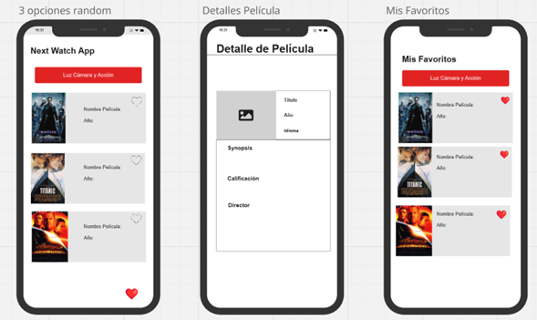

<h1 align="center">Borrador de Proyecto de la Aplicación Android</h1>

<strong>Alumna:</strong> Paulina Brajovic

<strong>Curso:</strong> COM 437

<strong>Storyboard:</strong> <a href="https://miro.com/app/board/uXjVLAtvtQU=/">https://miro.com/app/board/uXjVLAtvtQU=/</a>

<h2>Descripción del proyecto</h2>

    La aplicación permitirá a los usuarios obtener sugerencias aleatorias de películas o series cuando no sepan qué ver. Se basará en una API de películas para ofrecer títulos populares y aleatorios, simulando una experiencia entretenida y visualmente atractiva con un botón que genera tres opciones de películas o series al azar.

<h2>Exposición del problema</h2>

    Muchas personas pasan tiempo buscando qué ver y no logran decidirse. Esta aplicación soluciona ese problema ofreciendo sugerencias aleatorias basadas en una base de datos masiva de películas y series.

<h2>Plataforma</h2>
<ul>
    <li><strong>Android</strong>, usando <strong>Kotlin</strong> en <strong>Android Studio</strong>.</li>
    <li><strong>API:</strong> OMDB</li>
</ul>

<h2>Interfaz de usuario e interfaz de administrador</h2>

La aplicación no requiere el perfil de administrador.

<h2>Funcionalidad</h2>

    Generación aleatoria de películas: 

Los usuarios pueden presionar un botón que les ofrece tres películas o series seleccionadas aleatoriamente. Cada una de estas opciones aparece en forma de tarjetas (cards) con información básica, como el título y una breve descripción.

    Selección de detalles de la película: 

Los usuarios pueden hacer clic en cualquiera de las tarjetas para ser dirigidos a una nueva pantalla donde se muestran detalles más completos de la película o serie seleccionada, tales como la sinopsis, el elenco, las calificaciones, entre otros.

   Agregar a favoritos:

Cada tarjeta incluirá un botón que permitirá agregar la película o serie a una lista de favoritos. Los usuarios podrán acceder a esta lista en cualquier momento para revisar sus títulos preferidos.

  Interacción continua:

Después de revisar las tres opciones, los usuarios podrán generar tres nuevas sugerencias en cualquier momento, presionando de nuevo el botón.

<h2>Diseño (Wireframes o esquemas de página)</h2>

